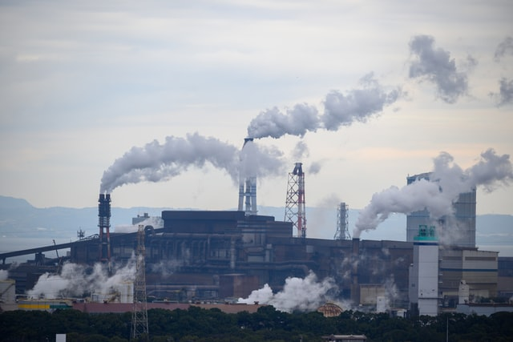

# Luis Ruiz-Santiago
## ________________________________________________________________________
## Welcome to my portfolio page
This page will feature some of the work I have done using Python, Excel, and Tableau. For Tableau, don't forget to check my [Tableau Public page!](https://public.tableau.com/profile/luis.ruiz.santiago#!/)
## Education
- Data Analytics Immersion Program at Thinkful
- IBM Data Analyst Professional Certificate
- Master's Degree in Chemical Engineering at the University of Rochester - River Campus
- Bachelor's Degree in Chemical Engineering at the University of Puerto Rico - Mayagüez

## [Project 1: Airline Sentiment Analysis in Twitter](https://airline-sentiments.herokuapp.com/)

Photo by <a href="https://unsplash.com/@snowjam?utm_source=unsplash&utm_medium=referral&utm_content=creditCopyText">John McArthur</a> on <a href="https://unsplash.com/s/photos/air-travel?utm_source=unsplash&utm_medium=referral&utm_content=creditCopyText">Unsplash</a>
  
- This is a dashboard developed to visualize sentiment analysis of tweets about 6 airlines and deployed to Heroku
- Python libraries used: Pandas, Streamlit, Matplotlib, Plotly Express
- Input: csv file with Tweets
- Output: Sentiment of airlines
- Repository can be found [here](https://github.com/ldruizsan/airlines-sentiment)

## [Project 2: Visualizing US Pollution Data 2000-2016](https://gist.github.com/ldruizsan/56cbce888b288daefd14a27d73c8b479)

Photo by <a href="https://unsplash.com/@pafuxu?utm_source=unsplash&utm_medium=referral&utm_content=creditCopyText">Kouji Tsuru</a> on <a href="https://unsplash.com/s/photos/pollution?utm_source=unsplash&utm_medium=referral&utm_content=creditCopyText">Unsplash</a>
  
- The goal of this project is to visualize the trends of 4 pollutants that are part of what the EPA calls [criteria pollutants](https://www.epa.gov/criteria-air-pollutants) and determine if the US has complied with the standards that have been established by the EPA.
- Python libraries used: Pandas, Matplotlib, Seaborn, Scipy.Stats
- Input: concentration levels by location for ground-level ozone, sulfur dioxide, nitrogen oxide, and carbon monoxide along the Air Quality Index (AQI) for each
- Output: Visualization of trends using lineplots and measure statistical significances

## [Project 3: HR Model Development for new commission structure](https://drive.google.com/file/d/1n1fFSaahajSvQBpIWrrh4Mkkgloesfou/view?usp=sharing)

Photo by <a href="https://unsplash.com/@dylandgillis?utm_source=unsplash&utm_medium=referral&utm_content=creditCopyText">Dylan Gillis</a> on <a href="https://unsplash.com/s/photos/human-resource?utm_source=unsplash&utm_medium=referral&utm_content=creditCopyText">Unsplash</a>
- This project evaluated performance of account executives and developed models for a new sales commission structure for the new fiscal year
- Three strategies were considered:
  - Assume the company is increasing the book of business, no increase in headcount, same compensation structure
  - Modify the compensation structure with the same target revenue (no BoB growth) and no increase in headcount
  - Increase headcount while keeping the same structure and book of business
- A fourth strategy combines the first 3 to estimate the impact
- The model showed that, individually, the first strategy provided the largest revenue growth by over $200 million. However, combining all three is expected to grow by over $400 million.
- The project also includes an employee dashboard that allows to look up performance of any single account executive and a dashboard to evaluate the performance of executives by level

## [Project 4: Maven Analytics Toy Challenge Tableau Dashboard](https://public.tableau.com/app/profile/luis.ruiz.santiago/viz/MavenMexicoToyStoreChallenge/MavenToyCompanyinMexico)

Photo by <a href="https://unsplash.com/@yuliamatvienko?utm_source=unsplash&utm_medium=referral&utm_content=creditCopyText">Yulia Matvienko</a> on <a href="https://unsplash.com/s/photos/toys?utm_source=unsplash&utm_medium=referral&utm_content=creditCopyText">Unsplash</a>
- This is my submission for Maven Analytics' Toys challenge and we we tasked with providing insight into possible expansion strategies for the company
- My analysis showed the company has a lot of inventory at hand and identified three cities in Mexico that can be considered for opening new stores that are closer to high-volume areas and can also help distribute excess inventory
- For a full description of the situation, make sure to check my [LinkedIn post](https://www.linkedin.com/posts/luisruiz1_maventoyschallenge-activity-6800563436620267520-6hk3)

## [Project 5: Python for Finance: Capital Assets Pricing Model and Beta](https://github.com/ldruizsan/python-capm-finance)

Photo by <a href="https://unsplash.com/@ishant_mishra54?utm_source=unsplash&utm_medium=referral&utm_content=creditCopyText">Ishant Mishra</a> on <a href="https://unsplash.com/?utm_source=unsplash&utm_medium=referral&utm_content=creditCopyText">Unsplash</a>
- This was a project that analyzed stock daily returns for 6 major tech stocks and compare their performance to that of the S&P500
- Parameter Beta was calculated using CAPM for each stock to determine volatility relative to the market
